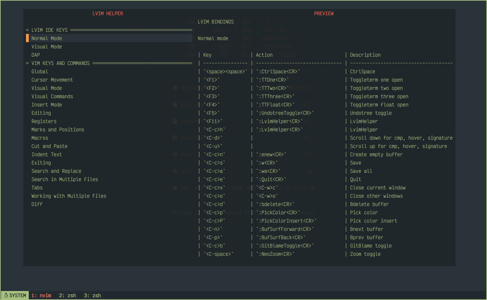

# LVIM HELPER

Neovim plugin written in Lua. Show your custom help files.


[](https://github.com/lvim-tech/lvim-colorscheme/blob/main/LICENSE)

## Screenshot



## Requirements

-   [neovim (>=0.8.0)](https://github.com/neovim/neovim/wiki/Installing-Neovim)
-   [nui.nvim](https://github.com/MunifTanjim/nui.nvim)
-   [nvim-notify](https://github.com/rcarriga/nvim-notify)

## Install

```lua
use({
	"lvim-tech/lvim-helper",
	config = function()
		require("lvim-helper").setup({
			content = {
				{
					type = "separator",
					title = " THIS IS SEPARATOR ",
				},
				{
					type = "link",
					title = "  TITLE LINK 1  ",
					file = "/path/to/file1.md",
					file_type = "markdown",
				},
				{
					type = "link",
					title = "  TITLE LINK 2  ",
					file = "/path/to/file2.md",
					file_type = "markdown",
				},
				{
					type = "separator",
					title = " THIS IS SEPARATOR ",
				},
				{
					type = "link",
					title = "  TITLE LINK 3  ",
					file = "/path/to/file3.md",
					file_type = "markdown",
				},
				{
					type = "link",
					title = "  TITLE LINK 4  ",
					file = "/path/to/file4.md",
					file_type = "markdown",
				},
			},
			border_style_menu = { " ", " ", " ", " ", " ", " ", " ", " " },
			border_style_preview = { " ", " ", " ", " ", " ", " ", " ", " " },
		})
	end,
})
```

## Command

```lua
:LvimHelper
```

## Keymaps

| Key                                        | Description                    |
| ------------------------------------------ | ------------------------------ |
| `<Esc>`, `q`, `<C-c>e`, `<C-c>x`, `<C-c>d` | Close                          |
| `<C-d>`                                    | Scroll Down Preview            |
| `<C-u>`                                    | Scroll Up Preview              |
| `l`                                        | Switch Layout ('row' or 'col') |
| `h`                                        | Help for Lvim Helper           |
